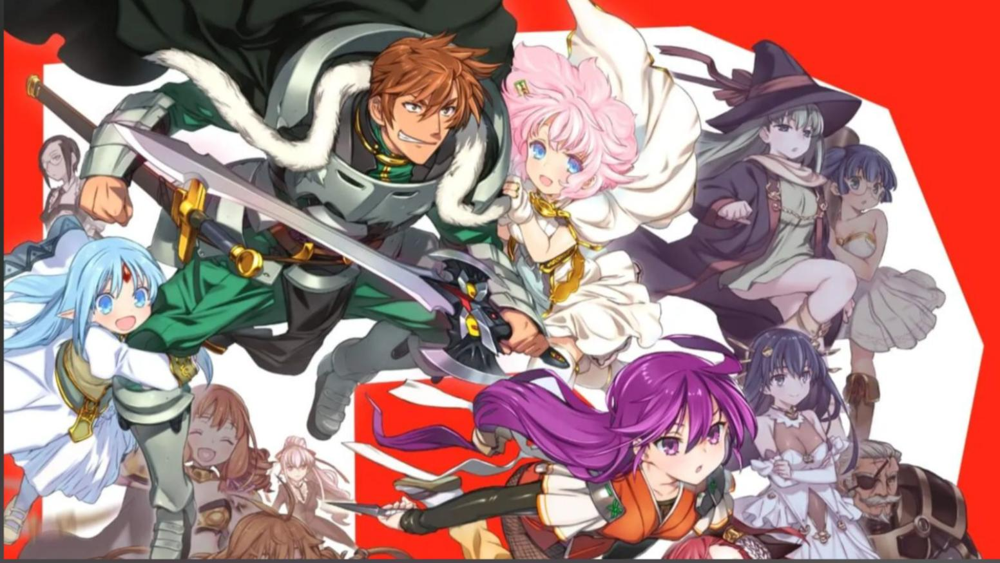

# dsh-lansi-webUI

English | [中文](README.md)

A "Rance crimson-black adventure" theme plugin for the DeepSeek Harness Web UI, rebuilt on top of [dsh-maid-whale-webUI](https://github.com/yunxiiQwQ/dsh-maid-whale-webUI/).



## Features

- **Crimson-black adventure look**: deep-red primary `#c02a2a`, red rounded borders, RPG-style sword / heart / flame ornaments
- **Light & dark dual modes**: cream-paper light + crimson-black dark, following the DSH appearance setting (Settings → General → Appearance)
- **Full-screen illustrated background**: the Rance 35th-anniversary group illustration, fixed, centered, gaussian-blurred with a translucent veil
- **Persistent bottom-left mascot**: a pink-haired Q-version character (transparent background)
- **Red sword emblem** next to the workspace label, replacing the original whale icon; sessions carry a small red crest ornament

## Layout

```
dsh-lansi-webUI/
├── README.md / README.en.md   # Documentation
├── LICENSE                    # BSD-3-Clause
└── lansi-webui/               # Plugin source (loaded directly by dsh plugin)
```

## Installation

```powershell
cd dsh-lansi-webUI
dsh plugin --profile web add ./lansi-webui
```

Refresh or restart the DeepSeek Harness Web UI after installation. Enabling only one UI theme at a time is recommended.

## Development

```powershell
cd lansi-webui
pnpm install
pnpm art:embed
pnpm test
pnpm build
```

The plugin uses only the official DSH client plugin mechanism. It does not modify the DeepSeek Harness source code or affect model requests.

## Credits

Thanks to the author (yunxiiQwQ) of [dsh-maid-whale-webUI](https://github.com/yunxiiQwQ/dsh-maid-whale-webUI/); this plugin is rebuilt on top of that project's architecture.

## License and Disclaimer

The code is licensed under BSD-3-Clause. This is an unofficial community theme whose assets originate from community fan creations. It is not affiliated with DeepSeek.
